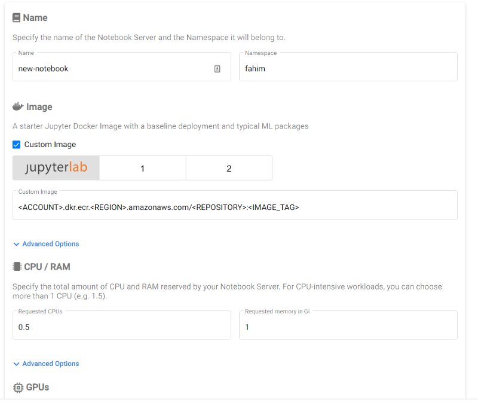

Kubeflow installation comes with a way to run web-based development environments inside Pods. It currently supports
 JupyterLab, RStudio, and Visual Studio Code (code server). The Kubeflow installation comes with a number of container
 images, but custom docker images for specific working environments can be created. We can get one of the base images
  publicly available and extend it for our use case. This process is described in the following three steps:

* Create a new container image by extending the base image and installing new libraries that are typically used by your
teams. The following docker file takes a base image and installs TensorFlow datasets, Scikit Learn, and pandas libraries.


```bash
FROM public.ecr.aws/j1r0q0g6/notebooks/notebook-servers/jupyter:v1.5.0

USER root

RUN pip3 install tensorflow-datasets==2.1.0 \
                 scikit-learn==1.1.0 \
                 pandas==1.0.3
ENV NB_PREFIX /
```

* Login to ECR to push a new notebook image.

```bash
REGION=<AWS Region>
ACCOUNT=<AWS account ID>
aws ecr get-login-password - region $REGION | docker login - username AWS - password-stdin $ACCOUNT.dkr.ecr.$REGION.amazonaws.com
```

* Build and push the docker image to ECR

```bash
REPOSITORY=<your repository name>
IMAGE_NAME=$ACCOUNT.dkr.ecr.$REGION.amazonaws.com/$REPOSITORY
IMAGE_TAG=tensorflow-2.1.0-jupyter-modified
docker build -t $IMAGE_NAME:$IMAGE_TAG .
docker push $ACCOUNT.dkr.ecr.$REGION.amazonaws.com/$REPOSITORY:$IMAGE_TAG
```

Once we have an extended Jupiter image, we can always import it when initializing a new Jupiter server, as shown below.


