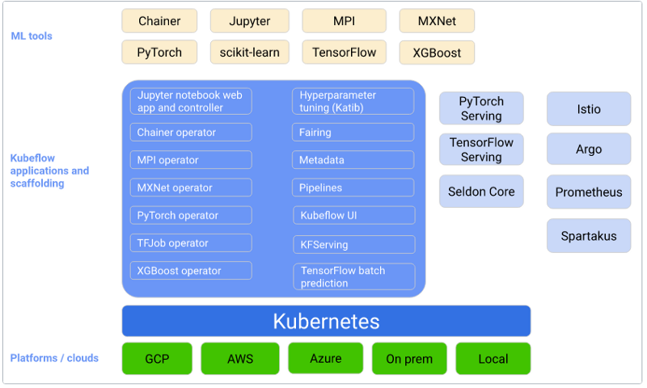
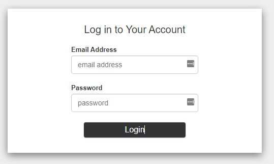

Kubeflow is an end-to-end ML platform for Kubernetes and has components for each stage of the ML lifecycle.
Kubeflow is for data scientists in building and experimenting with ML pipelines and for ML engineers deploying
ML systems to various environments for developing, testing, and production-level serving. Developing an ML
system is an iterative process and consists of several stages. Each stage needs to be evaluated with necessary
changes in model parameters to ensure the model produces the desired results. Kubeflow has many components that
 make this task easy for ML practitioners. The following diagram shows the components of
  Kubeflow that sit on the Kubernetes cluster that can be deployed to any public cloud provider or on-prem servers.

 

 Before anything else, we must ensure we have proper IAM access to create an EKS cluster.
 Follow this instruction to create an IAM user if you don't have any, and use that to set up your credentials.
 It is recommended to use AWS-CLI to configure AWS credentials. To set them up through the `aws-cli` ,
 install it first, then run `aws configure` to configure the AWS-CLI and credentials:


```bash
$ aws configure
AWS Access Key ID [None]:
AWS Secret Access Key [None]:
Default region name [None]:
Default output format [None]:
```

After we get the proper IAM access to create an EKS cluster, installing Kubeflow to the cluster contains three steps:

* Set up the development environment. We will use eksctl to deploy the EKS cluster using CLI, kubectl to communicate
 with the cluster, and Kustomize to apply Kubeflow manifests to the cluster.

```bash
#! /bin/bash.

echo "***********************Install kubectl******************************"

sudo curl --silent --location -o /usr/local/bin/kubectl \
   https://amazon-eks.s3.us-west-2.amazonaws.com/1.19.6/2021-01-05/bin/linux/amd64/kubectl

sudo chmod +x /usr/local/bin/kubectl

## 2. install eksctl
echo "***********************Lauch EKS cluster******************************"

curl --silent --location "https://github.com/weaveworks/eksctl/releases/latest/download/eksctl_$(uname -s)_amd64.tar.gz" | tar xz -C /tmp

sudo mv -v /tmp/eksctl /usr/local/bin
eksctl version

## 3. install kustomize
echo "***********************Install kustomize ******************************"

curl --silent --location --remote-name \
"https://github.com/kubernetes-sigs/kustomize/releases/download/kustomize/v3.2.3/kustomize_kustomize.v3.2.3_linux_amd64" && \
chmod a+x kustomize_kustomize.v3.2.3_linux_amd64 && \
sudo mv kustomize_kustomize.v3.2.3_linux_amd64 /usr/local/bin/kustomize
```


* Once eksctl is installed, we can use the eksctl create cluster command to create a new EKS cluster.
This command takes several arguments that allow you to specify the cluster's configuration, such as the
number of worker nodes and the version of Kubernetes to use. We can also write the arguments in a configuration
 file to simplify the creation of the EKS cluster. Deploy an EKS cluster using eksc with kubeflow.yaml
 configuration file shown below.

```yaml
---
apiVersion: eksctl.io/v1alpha5
kind: ClusterConfig

metadata:
  name: kubeflow
  region: us-east-1
  version: "1.19"

availabilityZones: ["us-east-1a", "us-east-1b", "us-east-1c"]

managedNodeGroups:
- name: nodegroup
  desiredCapacity: 5
  instanceType: m5.xlarge
  ssh:
    enableSsm: true

secretsEncryption:
  keyARN: <enter your secrete encryption key here>
```

Deploy the cluster using `eksctl create cluster -f kubeflow.yaml` command. It's important to note that creating
an EKS cluster can take some time, as the worker nodes need to be provisioned, and the Kubernetes control
plane needs to be set up. You can check the status of the cluster creation process by running the `eksctl get
 clusters` command.

To install Kubeflow, we must apply the manifests to the EKS cluster. We will use Kubeflow on AWS, which is
an open-source distribution of Kubeflow with AWS. Download Kubeflow manifests (Kubeflow v1.4.1, aws-b1.0.0)
 from their GitHub using the following command.

```bash
export KUBEFLOW_RELEASE_VERSION=v1.4.1
export AWS_RELEASE_VERSION=v1.4.1-aws-b1.0.0
git clone https://github.com/awslabs/kubeflow-manifests.git && cd kubeflow-manifests
git checkout ${AWS_RELEASE_VERSION}
git clone --branch ${KUBEFLOW_RELEASE_VERSION} https://github.com/kubeflow/manifests.git upstream
```

Install all Kubeflow official components (residing under apps) and all common services (residing under common)
 using either Kustomize or Helm with a single command:

```bash
while ! kustomize build docs/deployment/vanilla | kubectl apply -f -; do echo "Retrying to apply resources"; sleep 10; done
```

After the installation is completed, make sure all the components are installed by connecting to the cluster
using the following eksctl commands:

```bash
kubectl get pods -n cert-manager
kubectl get pods -n istio-system
kubectl get pods -n auth
kubectl get pods -n knative-eventing
kubectl get pods -n knative-serving
kubectl get pods -n kubeflow
kubectl get pods -n kubeflow-user-example-com
```

Once the installation is complete, you can use it to connect to the Kubeflow cluster by running the following
 command:

```bash
kubectl port-forward svc/istio-ingressgateway -n istio-system 8080:80
```

This will forward port 8080 on your local machine to the ingress gateway service on the Kubeflow cluster,
 allowing you to access the Kubeflow web interface. To access the web interface, open a web browser and
 navigate to http://localhost:8080. This will open the Kubeflow dashboard, as shown in Figure xx. Kubeflow
 uses Dex as a login service, and the default user and password information are  email: user@example.com,
 password: 12341234

 

 We can change the email and the password by managing profiles, users, and contributors that will be
 described in the section (Kubeflow multi-tenancy).
