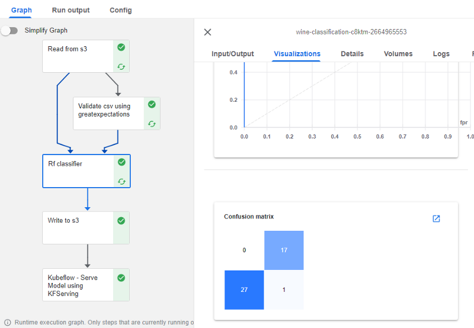

Kubeflow Pipelines
The Kubeflow pipeline, a set of automated steps that define how data should be processed and transformed and how ML models are trained and deployed, is one of the most popular components of the Kubeflow platform. There are several reasons why Kubeflow ML pipelines are useful:

1. Automation: Kubeflow pipelines automate the process of building and deploying ML models, making it easier to develop and maintain high-quality models over time. This can save time and effort and reduce the risk of errors.

2. Reproducibility: Kubeflow pipelines are defined using a version-controlled specification, making them easy to reproduce and debug. This is important for ensuring the reliability and reproducibility of ML models.
3. Collaboration: Kubeflow pipelines support multiple users and allow you to track and manage the progress of your ML workflows. This can make it easier to collaborate with other team members and stakeholders.
4. Scalability: Kubeflow pipelines can be run on large-scale compute resources, allowing you to scale your ML workflows to handle large amounts of data and compute resources.
5. Portability: Kubeflow pipelines can be deployed on any Kubernetes cluster, making it easy to move your ML workflows between different environments.

Kubeflow pipelines can also be used for experimentation tracking and visualizations. The following Figure
shows an example Kubeflow pipeline created for classifying different wines using a random forest classifier.
 The complete code for this problem can be found in this GitHub repository.

  The pipeline gets the data from S3, validates the data using the Great Expectation library, trains a
  random classifier, writes the trained model to S3, and serves the model using KFServing. Each pipeline
  step is an independent pod in Kubernetes with data passing between them. The individual steps can be debuted
   independently and using logs, inputs and outputs, and visualizations. In the Figure below,
   the Rf_classifier, which is the training step of the pipeline, includes some visualization of ROC
    and confusion matrix as part of the pipeline run.

 
